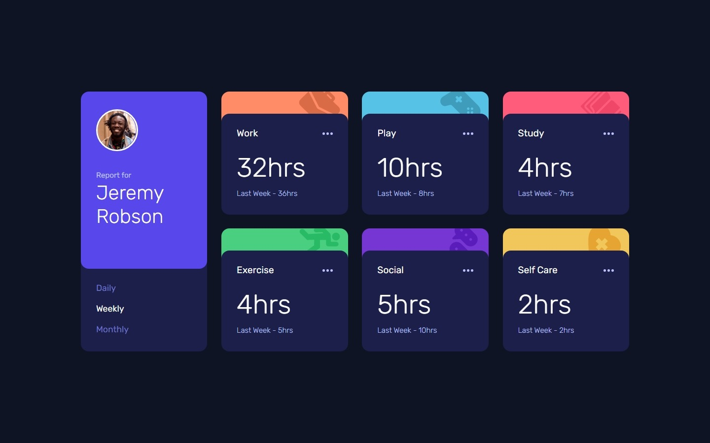
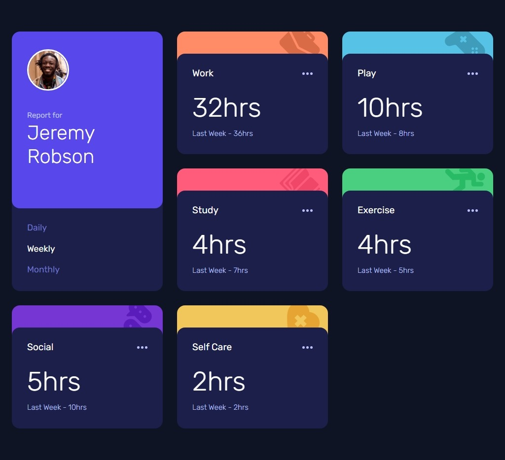
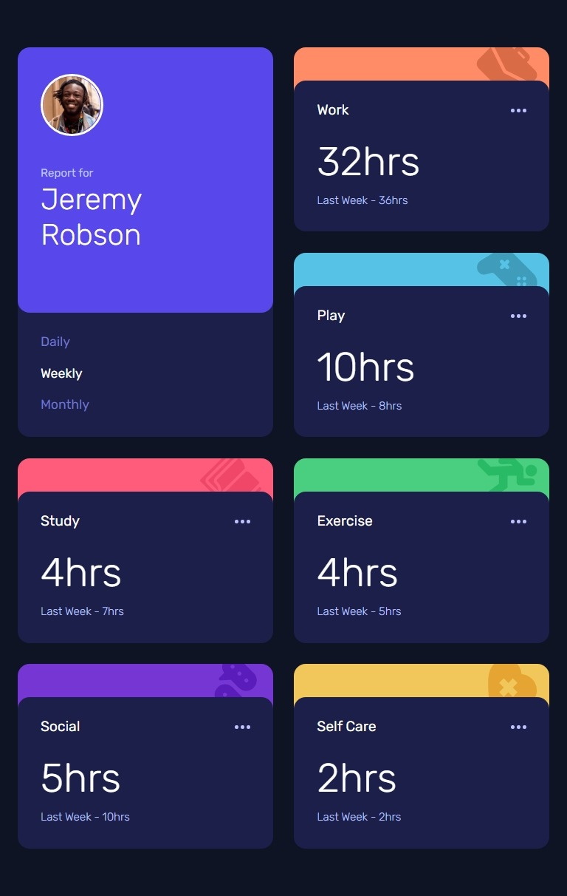
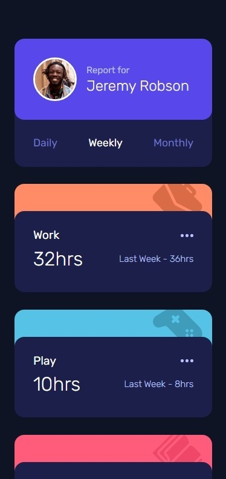
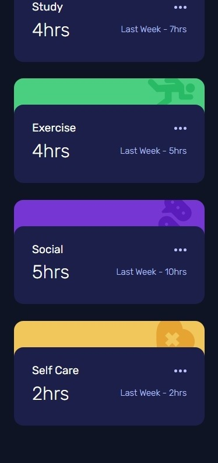

# Frontend Mentor - Time tracking dashboard solution

This is a solution to the [Time tracking dashboard challenge on Frontend Mentor](https://www.frontendmentor.io/challenges/time-tracking-dashboard-UIQ7167Jw). Frontend Mentor challenges help you improve your coding skills by building realistic projects. 

## Table of contents

- [Overview](#overview)
  - [The challenge](#the-challenge)
  - [Screenshot](#screenshot)
  - [Links](#links)
- [My process](#my-process)
  - [Built with](#built-with)
  - [What I learned](#what-i-learned)
- [Author](#author)

## Overview

### The challenge

Users should be able to:

- View the optimal layout for the site depending on their device's screen size
- See hover states for all interactive elements on the page
- Switch between viewing Daily, Weekly, and Monthly stats

### Screenshot

 
<strong>Desktop</strong>

    
Laptop

  
 
<strong>Laptop</strong>

    
Tablet

  
 
<strong>Laptop</strong>

 

 
<strong>Mobile</strong>

### Links

- Live Site URL: [https://zerescas.github.io/time-tracking-dashboard](https://zerescas.github.io/time-tracking-dashboard)

## My process

### Built with

- Semantic HTML5 markup
- CSS custom properties, flexbox and grid

### What I learned

Improve my HTML / CSS knowledges.

## Author

- Twitter - [https://twitter.com/zerescas](https://twitter.com/zerescas)
- Telegram - [https://t.me/zerescas](https://t.me/zerescas)
